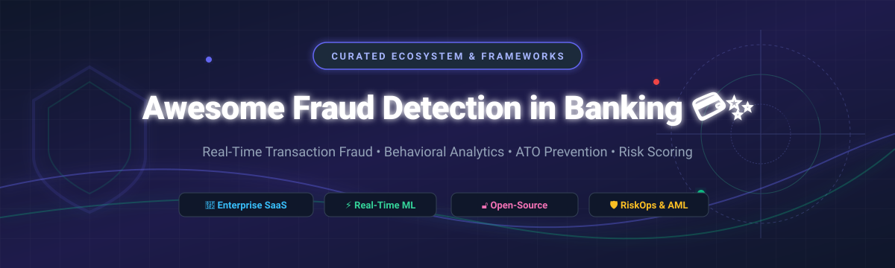

# 🛡️ Awesome Fraud Detection in Banking 💳✨

  

  
  
  
  
  
  

---

## 📌 Ecosystem & Industry Overview

Welcome to the **Curated Guide to Banking Fraud Detection, Behavioral Analytics, Account Takeover (ATO) Prevention, Risk Scoring & Anti-Money Laundering (AML) Solutions** 🚀.

### 📊 Market Size & Industry Structure
> **Market Dynamics:** The global banking fraud detection and prevention market is estimated at **\$28.5 Billion (2024)** and is projected to expand to **\$67.8 Billion by 2030** at a CAGR of **15.5%**. The sector is **moderately fragmented**, featuring established enterprise decisioning powerhouses (FICO, SAS) alongside high-growth AI RiskOps unicorns (Feedzai, Sift, BioCatch) and niche behavioral biometrics providers. While enterprise compliance requirements create high switching costs, no single vendor holds a "winner-take-all" monopoly, allowing specialized AI fintechs to thrive alongside open-source engines.

---

## 📑 Table of Contents
- [🏢 SaaS & Enterprise Hosted Platforms](#-saas--enterprise-hosted-platforms)
- [🔓 Open-Source GitHub Projects](#-open-source-github-projects)
- [🤝 How to Contribute](#-how-to-contribute)
- [☕ Support & Sponsorship](#-support--sponsorship)
- [📈 Star History](#-star-history)
- [⚠️ Disclaimer](#%EF%B8%8F-disclaimer)

---

## 🏢 SaaS & Enterprise Hosted Platforms

Below is a comparison of top enterprise fraud prevention platforms sorted by **Company Size / Valuation (Descending)** 📉.

| Platform | Key Focus & Capabilities | Company Size / Valuation | Starting Tier Price | Free Tier / Trial Limit |
| :--- | :--- | :--- | :--- | :--- |
| **[FICO Falcon](https://www.fico.com/)** 💳 | Industry-standard payment card fraud detection & decisioning engine used by major global banks. | **\$38 Billion** *(FICO Market Cap)* | **\$100,000 / year** enterprise contract | 30-day proof-of-concept trial for qualified financial institutions |
| **[Featurespace](https://www.featurespace.com/)** 🧠 | Adaptive behavioral analytics (ARIC) for real-time transaction risk scoring & false-positive reduction. | **\$925 Million** *(Acquired by Visa, Sep 2024)* | **\$4,500 / month** platform base tier | 14-day guided sandbox trial with synthetic transaction data |
| **[Feedzai](https://www.feedzai.com/)** 🛡️ | AI-native RiskOps platform unifying transaction monitoring, AML compliance, & behavioral intelligence. | **\$2.0 Billion** *(Series E Valuation)* | **\$3,500 / month** mid-market tier | 60-day Feedzai IQ Score trial program for financial institutions |
| **[BioCatch](https://www.biocatch.com/)** 👆 | Continuous behavioral biometrics detecting ATO, social engineering scams, & bot attacks via interaction dynamics. | **\$1.3 Billion** *(Enterprise Valuation, \$185M+ ARR)* | **\$2,500 / month** starting package | 30-day pilot trial with session risk scoring API |
| **[SEON](https://seon.io/)** 🔍 | Digital footprint analysis, device intelligence, & explainable ML rule engine for fintechs & banks. | **\$500 Million** *(Valuation)* | **\$599 / month** Starter plan | **Forever Free Plan** (500 manual checks/mo, 2 QPS, 2 users, 10 custom rules) & 14-day full free trial |
| **[Sift](https://sift.com/)** 🤖 | Digital trust & safety suite providing real-time payment fraud prevention, ATO defense, & identity risk. | **\$1.0 Billion+** *(Valuation)* | **\$150 / month** base API tier | 14-day free trial (up to 10,000 monthly active user events) |
| **[DataVisor](https://www.datavisor.com/)** 🌐 | Unsupervised machine learning & graph analytics platform built to catch coordinated fraud rings & ATO. | **\$260 Million** *(Valuation)* | **\$2,000 / month** starting tier | 30-day trial with sample transaction dataset ingestion |
| **[Fraud.net](https://www.fraud.net/)** 🕸️ | Collective intelligence & AI-driven fraud management platform leveraging cross-institution risk sharing. | **\$50 Million+** *(Estimated Valuation)* | **\$0.10 / transaction** (\$500/mo minimum) | 14-day free trial with 1,000 complimentary API risk checks |

---

## 🔓 Open-Source GitHub Projects

Explore production engines, baseline ML models, synthetic datasets, and transaction monitoring tools. Repositories are sorted by **GitHub Star Count (Descending)** ⭐.

| Repository | Stars | Key Features & Banking Use Case |
| :--- | :--- | :--- |
| **[yzhao062/pyod](https://github.com/yzhao062/pyod)** 🐍 |  | Comprehensive Python toolkit for detecting outliers & anomalies in financial transaction features (Isolation Forest, LOF, Autoencoders). |
| **[sagnikghoshcr7/Credit-Card-Fraud-Detection](https://github.com/sagnikghoshcr7/Credit-Card-Fraud-Detection)** 💳 |  | Machine learning pipeline benchmarked on credit card transaction data using supervised classifiers & SMOTE balancing. |
| **[jube-home/aml-fraud-transaction-monitoring](https://github.com/jube-home/aml-fraud-transaction-monitoring)** ⚖️ |  | Open-source platform for real-time transaction monitoring, hybrid rule + ML scoring, case management, & compliance audit trails. |
| **[IBM/aml-sim](https://github.com/IBM/aml-sim)** 🏦 |  | Multi-agent simulator by IBM for generating realistic synthetic banking transaction graphs to benchmark AML & fraud models. |
| **[bibtissam/LSTM-Attention-FraudDetection](https://github.com/bibtissam/LSTM-Attention-FraudDetection)** 🧬 |  | Deep learning sequence framework combining LSTM & Attention mechanisms for temporal transaction fraud pattern recognition. |
| **[opensource-finance/osprey](https://github.com/opensource-finance/osprey)** 🦅 |  | Lightweight transaction-monitoring microservice using Common Expression Language (CEL) rules for high-throughput fraud decisioning. |

---

## 🤝 How to Contribute

Contributions are warmly welcomed! 🌟 Help keep this resource comprehensive and up-to-date:

1. **Fork** the repository 🍴
2. **Add/Edit** entries in `README.md` following the established table structure.
3. Ensure details include: **Name, Link, Factual Description, Pricing/Tier info, or Star Badges**.
4. Submit a **Pull Request (PR)** with a summary of changes.

---

## ☕ Support & Sponsorship

If you find this repository helpful for your research, team, or project, please consider supporting the project! 💖

- ⭐ **Star** this repository to increase visibility.
- 🔄 **Fork & Share** with your colleagues in risk engineering and banking fintech.
- ☕ **Buy Me a Coffee / Sponsor**: Support ongoing maintenance via the [GitHub Sponsor Dashboard](https://github.com/sponsors/ishandutta2007).

---

## 📈 Star History

---

## ⚠️ Disclaimer

- This repository is a **community-curated list** provided for educational and research purposes only.
- Open-source tools and baseline models are **not** direct replacements for regulated commercial risk management software or legal compliance frameworks.
- Pricing estimates and market figures are gathered from public market reports and vendor disclosures as of 2026.

---

Made with ❤️ for fraud, risk, and banking technology teams worldwide.

